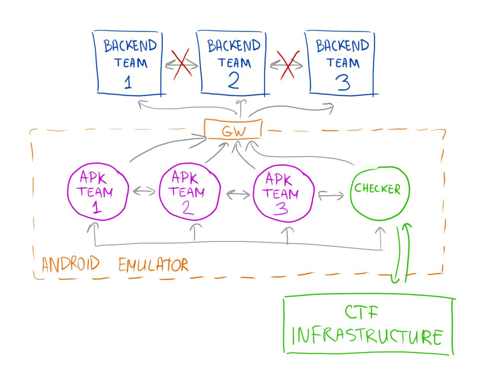

# About service

Hi there!

Task Infrastructure has several components:

- **Android Emulator**

  > Executes APK. Brain of the task.

- **Gateway (GW)**

  > Abstraction, that hide source IP address of packets

- **Checker**

  > Checker does some magic with pushing/pulling of the flag. Also checks functionality of task.

- **CTF Infrastructure**

  > Other CTF magic

**!!! Do Not Attack Task Infrastructure !!!**

Service has 2 parts:

- **Backend** Application
- Android Mobile Application (**APK**)

Basic structure of the service:



Every part is important and needs for the correct functioning of the service.

Every round **Deplolyer** takes your APK from `http://your-backend/apk/app.apk` and deploys it on the **Android Emulator**. Feel free to edit it, but be careful with changing basic functionality :)

Also feel free to change everything on the backend without changing main functionality.

Access to Backend of other teams can be made only using your APK. Every APK can interact with other alive APK.

**Checker** interacts with APK and Backend of every team.

Important information can be everywhere, except task infrastructure.

That's all that I can tell you. Good luck :)


# How to build Android App

## If Android SDK is already installed (ANDROID_HOME is exported on PATH)

Release: `./gradlew build :app:assembleRelease`

Application in `app/build/outputs/apk/release`

## Build via docker

```
docker-compose -f build.yaml build
```

Application in `/home/app/build/outputs/apk/release`

**NB**: Building the application for the first time can take about 10 minutes.
Rebuild (provided that you are connecting to an already deployed container) - less than a minute.

config.json contains information about the address of your backend and the identifier of your application.
It is strongly recommended that these values not be changed.


## IntentMessagingSystem (IMS)

This helper class is written specifically for communicating with other applications.